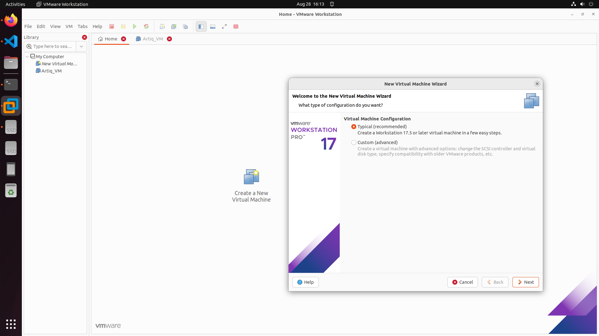
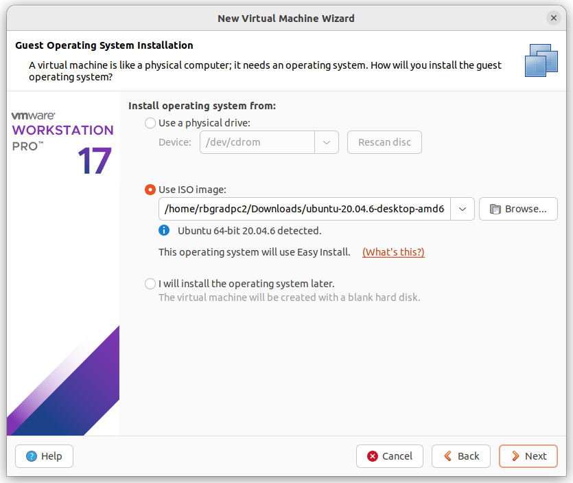
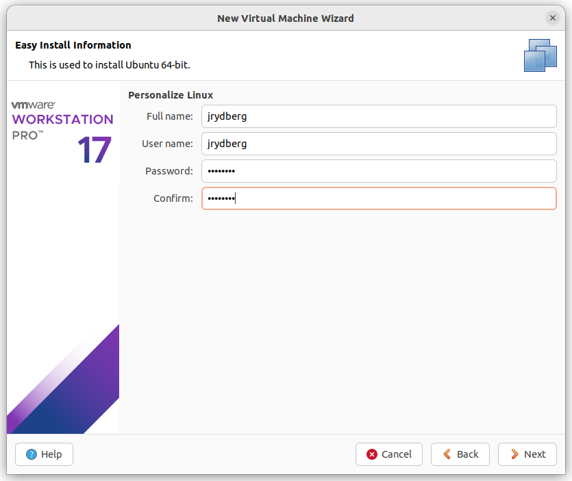
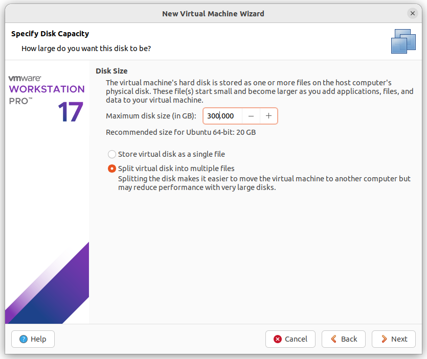
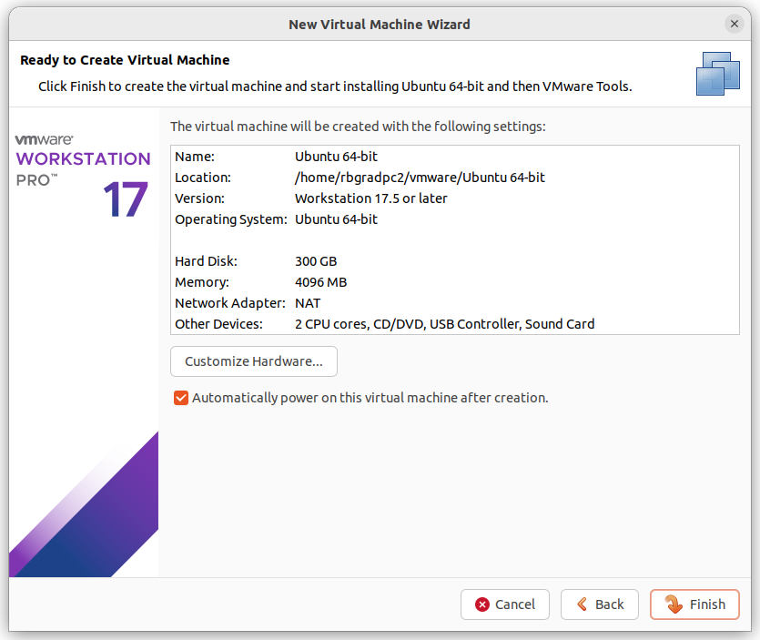

# Guide to build/use Artiq Virtual Machine

This document has instruction to download and build virutal machine that has Artiq enviornment. The goal is to have a portable virtual machine that can be shared with many computers to 

- Download the VMware and Ubuntu 20.4 and Vivado 2022.2. Choose VMware workstation for Windoes/Linux and VMware fusion for MAC.


# VMware Intallation Guide

## Windows
to be done
## MAC
to be done

## Linux

To install the VMware Workstation, after downloading the VMware, give executive access to the downloaded file using `chmod 777 VMware_xxx.bundle` and the run it `sudo ./VMware_xxx.bundle`.

For my case the **VMware-Workstation-Full-17.6.4-24832109.x86_64.bundle** was in the Download folder. I used the following commands after opening the terminal. Make sure to enter the super user password for any sudo commands. 


```bash
cd Download
chmod 777 VMware-Workstation-Full-17.6.4-24832109.x86_64.bundle
sudo apt install build-essential linux-headers-$(uname -r)
sudo ./VMware-Workstation-Full-17.6.4-24832109.x86_64.bundle
```

if now error now you successfully have a VMware installed on your Ubuntu. 

# Using prebuilt portable VM with Artiq Enviornment
To be done

# Creating Portable VM with Artiq Enviornment

After opening the VMware, Click on the Create a new Virtual Machine Icon and choose typical and Next.
<p align="center">
    
</p>

In the next window choose `use ISO image` option and using the browse button, choose the image file of the **Ubuntu 20.4** that you have downloaded and cliok Next. 

<p align="center">
    
</p>

Next make the name and possword as you like, but it is suggested to use `jrydberg`.


<p align="center">
    
</p>

Now choose the installation folder. I wnet with defult.


<p align="center">
    
</p>

Next we choose the Max disk size. I suggests `300GB` since we need to install `Vivado` that is going to be at least 40GB.

<p align="center">
    
</p>

Then in the next window you can change more hardware setting which I have used the defult. 

<p align="center">
    
</p>

After finishing, the VMware is going to install the Ubuntu VM on your device. It could take a while but relativley fast (5-10 minutes). After this step we need to install the Vivado 2022.2 on the VM.

## Installing Vivado on VM

First, on the VM Download the Vivado full offline installer (89GB) and unzip it. I have put the unziped folder on the cloud(TBD) which might be helpful. Install the dependencies, and then navigate inside the folders to get to `xsetup`. In my case I have used the following command where the xilixn_installer is at `home` directory.


```bash 
sudo apt-get update
sudo apt-get install -y libtinfo5 libncurses5 libxss1 libxtst6 libgtk-3-0 libcanberra-gtk-module libcanberra-gtk3-module libcurl4 libusb-1.0-0 build-essential
```
```bash
cd xilinx-installer/Xilinx_Unified_2022.2_1014_8888/
```

copy and paste the file [install_config.txt](./src/Vivado/install_config.txt) to the directory where the xsetup is. Then use the following command to install Vivado. Make sure that you are inside the xilinx installer where the `xsetup` exits.

```bash
chmod 777 xsetup
sudo ./xsetup -a XilinxEULA,3rdPartyEULA -b Install -c install_config.txt
```
This installation might take a while (about 20 minutes or more), be patient.

After successfull installation you want to add Vivado to the path. 
```bash
export PATH=/opt/Xilinx/Vivado/2022.2/bin:$PATH
source ~/.bashrc

sudo tee /etc/profile.d/vivado.sh >/dev/null <<'EOF'
# Load Xilinx Vivado (system-wide for login shells)
if [ -f /opt/Xilinx/Vivado/2022.2/settings64.sh ]; then
  . /opt/Xilinx/Vivado/2022.2/settings64.sh
fi
EOF

# ensure it’s readable and executable for everyone
sudo chmod a+rx /etc/profile.d /etc/profile.d/vivado.sh

```

### NIX package manager installation
Now we need to install NIX as this is the package manager that is used by Artiq. It will ask some question, say yes to all of them.

``` bash
sudo apt update
sudo apt install -y curl git locales
sh <(curl -L https://nixos.org/nix/install) --daemon
export PATH=/nix/var/nix/profiles/default/bin:$PATH
source ~/.bashrc
mkdir -p ~/.config/nix
echo "experimental-features = nix-command flakes" > ~/.config/nix/nix.conf
```

### Installing Artiq

The directory that you run these commands will become the driectory for the enviornment. I suggest creating a directory where you are more cofortable but my suggestion is to try to name it neatly so you can organize later. Overall, to install Artq there are two ways. 
- use the defult settings of the artiq (we use artiq 7 for now). Make sure to say yes to the questions.
   ```bash 
   mkdir -p ~/Documents/Projects/Artiq_envs/defult/
   cd ~/Documents/Projects/Artiq_envs/defult/
   nix profile install git+https://github.com/m-labs/artiq.git\?ref=release-7
   nix develop git+https://github.com/m-labs/artiq.git\?ref=release-7
   ```
- Or create your own custom enviornment by using the `flake.nix' file.
   `to be done, sounds like necessary to build the entagler core`


### testing Artiq

The most important command to test if Artq is installed is `artiq_master` which requires a `device_db.py` file. This file will indicate the how each port of Kasli is connected and their corresponding settings.

- more documnets needs to be added here

## After Artiq Enviornment
At this point you should have a Virtual machin that has the Artiq ENV

### Testing the Gateware buil up
To build a gateware you need to have a `.json` file that descirbes how each port of the **Kasli-soc** is connected to each card. For example [kasli-soc-standalone](./src/Node%201/kasli-soc-standalone_node1_with_edgecounters_en.json) file can be used to generate the gateware, first go to the dierctory that has the nix enviornment setup. For example in my case I have used

```bash
cd ~/Documents/Projects/Artiq_envs/defult
```

Copy and paste the `.json` configuration file and usie the following command. (just make sure to use absolute path to the 'json' file in the command below)

```bash
nix build --print-build-logs --impure --expr 'let fl = builtins.getFlake "git+https://git.m-labs.hk/m-labs/artiq-zynq?ref=release-7"; in (fl.makeArtiqZynqPackage {target="kasli_soc"; variant="standalone"; json=/home/jrydberg/Documents/Projects/Artiq_envs/defult/kasli-soc-standalone_node1_with_edgecounters_en.json;}).kasli_soc-standalone-sd'
```

This takes a while maybe 40+ minutes. And I got the error of 
```bash 
/etc/profile: line 19: /opt/Xilinx/Vivado/2022.2/settings64.sh: No such file or directory
```
I have solved this by
``` bash
source ~/.bashrc

sudo tee /etc/profile.d/vivado.sh >/dev/null <<'EOF'
# Load Xilinx Vivado (system-wide for login shells)
if [ -f /opt/Xilinx/Vivado/2022.2/settings64.sh ]; then
  . /opt/Xilinx/Vivado/2022.2/settings64.sh
fi
EOF

# ensure it’s readable and executable for everyone
sudo chmod a+rx /etc/profile.d /etc/profile.d/vivado.sh
```
However this command have been added to the Vivado installation guide so you should not get this problem.

After a successful build, you should be able to find the `boot.bin` file in the `result` directory.

Copy the [CONFIG.TXT](./src/kasli_SD_card/boot.bin)  and the [CONFIG.TXT](./src/kasli_SD_card/CONFIG.TXT) to a SD card and insert to a kasli-soc. Note that this guide is for kasli-soc, so some changes might be needed.


# Flashing Kasli-soc

You must have vivado installed, and then clone the artiq-zynq repo then using the fowllowing 3 commands you can flash the kasli-soc.

```bash
nix build .#kasli_soc-demo-jtag
nix develop
./local_run.sh
```

remember that maybe the build requires the Xilinx 2024.2 but we have the 2022.2 I have ask chatGPT to just create and alias for the 2022.2 and rename it as 2024.2 to bypass the requirement and it worked.

https://forum.m-labs.hk/d/363-how-do-i-get-gatewarefirmware-for-kasli-soc/7


