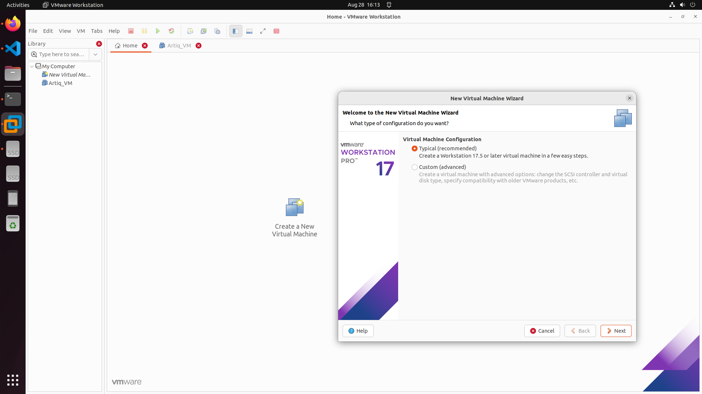
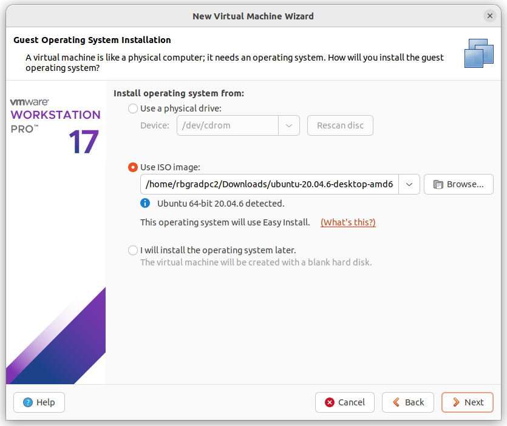
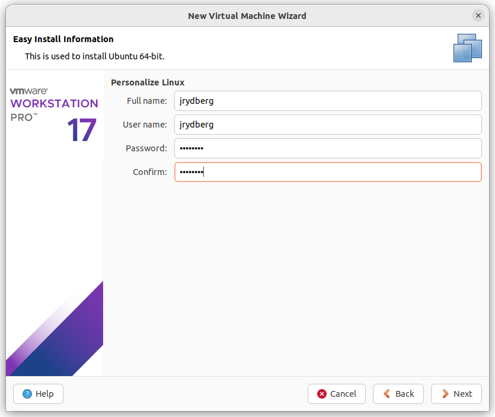

# Guide to build/use Artiq Virtual Machine

This document has instruction to download and build virutal machine that has Artiq enviornment. The goal is to have a portable virtual machine that can be shared with many computers to 

- Download the VMware and Ubuntu 20.4 and Vivado 2022.2. Choose VMware workstation for Windoes/Linux and VMware fusion for MAC.


# VMware Intallation Guide

## Windows
to be done
## MAC
to be done

## Linux

To install the VMware Workstation, after downloading the VMware, give executive access to the downloaded file using `chmod 777 VMware_xxx.bundle` and the run it `sudo ./VMware_xxx.bundle`.

For my case the **VMware-Workstation-Full-17.6.4-24832109.x86_64.bundle** was in the Download folder. I used the following commands after opening the terminal. Make sure to enter the super user password for any sudo commands. 


```bash
cd Download
chmod 777 VMware-Workstation-Full-17.6.4-24832109.x86_64.bundle
sudo apt install build-essential linux-headers-$(uname -r)
sudo ./VMware-Workstation-Full-17.6.4-24832109.x86_64.bundle
```

if now error now you successfully have a VMware installed on your Ubuntu. 

# Using prebuilt portable VM with Artiq Enviornment
To be done

# Creating Portable VM with Artiq Enviornment

After opening the VMware, Click on the Create a new Virtual Machine Icon and choose typical and Next.
<p align="center">
    
</p>

In the next window choose `use ISO image` option and using the browse button, choose the image file of the **Ubuntu 20.4** that you have downloaded and cliok Next. 

<p align="center">
    
</p>

Next make the name and possword as you like, but it is suggested to use `jrydberg`.


<p align="center">
    
</p>


